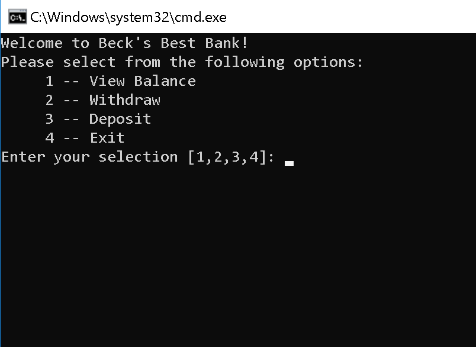
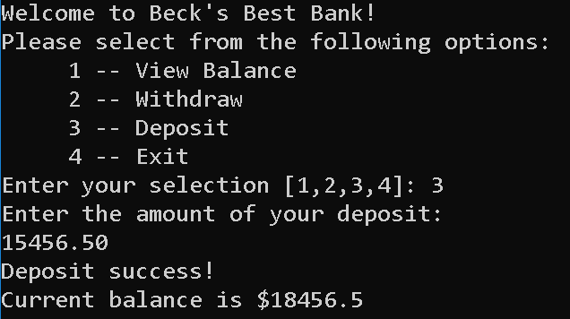
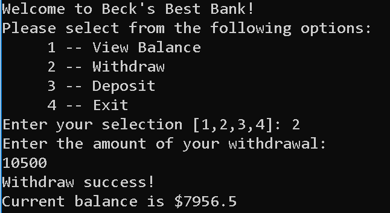
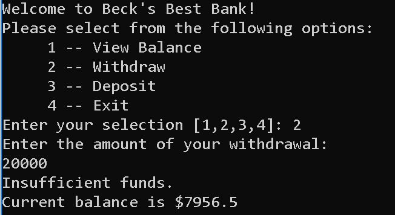

## Lab02 Unit Testing

# Problem Domain 
This console application acts like a bank ATM that allows the user to view account balance, deposit, and withdraw funds. The application prevents a negative balance or invalid deposit or withdraw ammounts.

# Load Application
1.	in terminal: git clone https://github.com/mtncrawler/lab02-unitTesting
2.	open project in Visual Studio
3.	open lab02-unittesting.sln
4.	run project without debugging 

